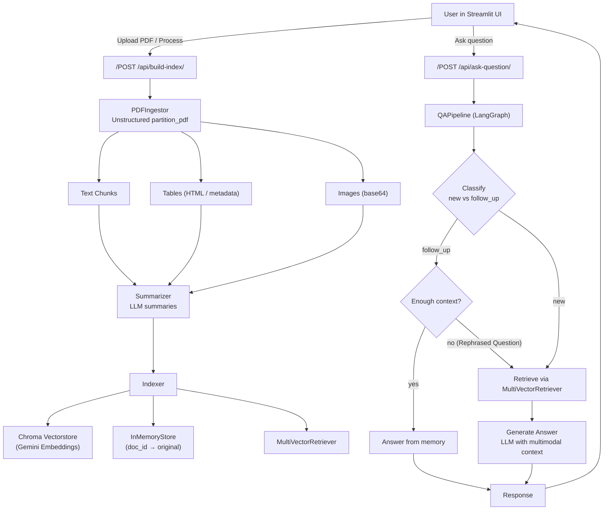

## DocuMate: Multimodal RAG AI Assistant

AI-powered question answering over PDFs that contain texts, tables, and images. DocuMate ingests a PDF, extracts multimodal content, summarizes each element for retrieval, indexes to a vector store, and answers questions using a retrieval-augmented generation (RAG) pipeline. It exposes a FastAPI backend and a Streamlit chat UI.

---

### Table of Contents
- [Key Features](#key-features)
- [Video Demo](#video-demo)
- [Repository Layout](#repository-layout)
- [Architecture and Data Flow](#architecture-and-data-flow)
- [Tech Stack](#tech-stack)
- [Configuration](#configuration)
- [Quickstart (Windows-friendly)](#quickstart-windows-friendly)
- [Running Backend and Frontend Separately](#running-backend-and-frontend-separately)
- [API Reference](#api-reference)
- [Internals](#internals)
- [Troubleshooting](#troubleshooting)
- [Development Tips](#development-tips)
- [License](#license)

### Key Features
- **Multimodal ingestion**: Extracts text, tables, and images from PDFs via Unstructured.
- **Searchable summaries**: LLM creates concise summaries for each modality to improve retrieval.
- **Vector search**: Summaries indexed in Chroma with Google Gemini embeddings.
- **Multi-vector retrieval**: Links summaries to original content using LangChain MultiVectorRetriever.
- **LangGraph workflow**: Classifies queries, optionally uses conversational memory, retrieves docs, and generates structured answers.
- **FastAPI + Streamlit**: REST API at `http://localhost:8000/api` and a modern chat UI.
- **Session-aware memory**: Follow-ups can be answered from prior Q&A context when sufficient.
- **Tracing ready**: LangSmith `@traceable` annotations across pipeline steps.

---

### Video Demo
Watch a short walkthrough of the app in action:

- Demo video: [DocuMate/awesomescreenshot.com/](https://www.awesomescreenshot.com/video/43678496?key=33ca11bc723b4ce643ea32948d30a752)

---

### Repository Layout
```
app.py                         # Orchestrates FastAPI (Uvicorn) + Streamlit
requirements.txt               # Python deps

src/
  api/
    fastapi_app.py            # FastAPI app factory
    routes.py                 # /health, /build-index, /ask-question, /reset
    models.py                 # Pydantic request/response schemas

  backend/
    pdf_ingestor.py           # PDF -> elements (texts, tables, images base64)
    summarizer.py             # LLM summarization for texts/tables/images
    indexing.py               # Build MultiVectorRetriever (Chroma + InMemoryStore)
    retriever.py              # Runtime retrieval using global retriever cache
    qa_pipeline.py            # LangGraph workflow for classification/memory/RAG

  frontend/
    streamlit_app.py          # Streamlit chat app, calls FastAPI routes

  utils/
    config.py                 # Loads env vars (LLM provider/model)
    logger.py                 # Loguru logger config
```

---

### Architecture and Data Flow

High level flow from PDF to answer:
1) Upload PDF (Streamlit) → `/api/build-index`
2) Extraction (`PDFIngestor`) via Unstructured:
   - Text chunks (CompositeElement by title)
   - Tables (structured; HTML in metadata when `infer_table_structure=True`)
   - Images (base64 captured with `extract_image_block_to_payload=True`)
3) Summarization (`Summarizer`) using your configured LLM:
   - Text summaries → searchable key concepts and facts
   - Table summaries → structure + insights
   - Image summaries → detailed descriptions (multimodal prompt)
4) Indexing (`Indexer`):
   - Store summaries in Chroma with Google Gemini embeddings
   - Link each summary to original content in an `InMemoryStore` via `doc_id`
   - Expose a `MultiVectorRetriever`
5) Question answering (`QAPipeline`):
   - Classify query: new vs. follow_up (uses LangGraph state history when available)
   - If follow_up: decide if previous context is enough; optionally answer from memory
   - Else rephrase the question and then retrieve top-k docs (summaries) and fan-in original content by modality
   - Generate structured answer; return with buckets for texts/tables/images

Notes:
- A module-level cache `BUILT_RETRIEVER` (in `indexing.py`) holds the active `MultiVectorRetriever` after indexing. The retriever is required before `/ask-question` is useful.
- `QAPipeline` uses `InMemorySaver` checkpoints for stateful history; `thread_id` keys separate sessions.

---

### Tech Stack
Python: 3.10+ recommended (project uses Pydantic v2 and modern LangChain stack).

Python packages (see `requirements.txt`):
- FastAPI, Uvicorn, Streamlit
- LangChain, LangGraph, LangSmith
- Chroma (`langchain_chroma`)
- Google Generative AI embeddings (`langchain_google_genai`)
- Unstructured with `all-docs` extra
- Loguru, Pydantic, Requests, Pandas, python-dotenv

System dependencies (for Unstructured on Windows):
- Poppler (PDF rendering), Tesseract OCR (image/text extraction), and related native libraries may be required by `unstructured[all-docs]`.
- Installers:
  - Poppler: download Windows binaries and add `bin` to PATH.
  - Tesseract OCR: install and ensure `tesseract.exe` is in PATH.

Embeddings dependency:
- Google Gemini Embeddings require `GOOGLE_API_KEY` to be set in the environment. See Configuration below.

---

### Configuration
Provide a `.env` file in the project root (or set environment variables) with:

```
LLM_PROVIDER=google
LLM_MODEL=gemini-1.5-flash
GOOGLE_API_KEY=your_api_key_here
LANGSMITH_API_KEY=your_api_key_here
LANGSMITH_TRACING= true
LANGSMITH_ENDPOINT= "https://api.smith.langchain.com"
LANGSMITH_PROJECT= "Multimodal RAG"

```

Notes:
- `src/utils/config.py` reads `LLM_PROVIDER` and `LLM_MODEL`.
- `GoogleGenerativeAIEmbeddings` (in `indexing.py`) uses your `GOOGLE_API_KEY` implicitly via environment.
- You can swap provider/model to OpenAI, Azure, etc., as supported by `langchain.chat_models.init_chat_model`.
- To use OpenAI models, set `OPENAI_API_KEY` and install `langchain-openai`, then set `LLM_PROVIDER=openai` and choose a valid `LLM_MODEL` (e.g., `gpt-4o-mini`). If you also want OpenAI embeddings, replace `GoogleGenerativeAIEmbeddings` with `OpenAIEmbeddings` in `src/backend/indexing.py`.

---

### Quickstart (Windows-friendly)

1) Create and activate a virtual environment
```
python -m venv venv
venv\Scripts\activate
```

2) Install Python dependencies
```
pip install -r requirements.txt
```

3) Install system dependencies (one-time)
- Install Poppler and Tesseract, and add to PATH.

4) Set environment variables
- Create `.env` in project root with `LLM_PROVIDER`, `LLM_MODEL`, and `GOOGLE_API_KEY`.

5) Run the app (backend + UI orchestrated)
```
python app.py
```
- This starts FastAPI (Uvicorn) at `http://localhost:8000` and then opens the Streamlit UI.

6) Use the UI
- Upload a PDF in the sidebar and click “Process Document”.
- Ask questions in the chat input. View retrieved texts/tables/images via the expander.
- Use “Reset” to clear the index and start a new session (new `thread_id`).

---

### Running Backend and Frontend Separately

Backend (FastAPI):
```
uvicorn src.api.fastapi_app:app --reload --host 0.0.0.0 --port 8000
```

Frontend (Streamlit):
```
streamlit run src/frontend/streamlit_app.py
```

Configure the frontend to point to the backend via `API_ROOT` in `src/frontend/streamlit_app.py` if needed (defaults to `http://localhost:8000/api`).

---

### API Reference
Base URL: `http://localhost:8000/api`

- Health
  - GET `/health`
  - Response:
    ```
    {"status": "Healthy", "message": "Multimodal RAG API is running"}
    ```

- Build Index
  - POST `/build-index`
  - Body:
    ```
    {"pdf_path": "C:/path/to/file.pdf"}
    ```
  - Response:
    ```
    {"status": "completed", "message": "Index built successfully from ...", "success": true}
    ```

- Ask Question
  - POST `/ask-question`
  - Body:
    ```
    {"question": "What are the key findings?", "thread_id": "optional-guid"}
    ```
  - Response:
    ```
    {
      "question": "...",
      "answer": "...",
      "context": {
        "texts": ["..."],
        "tables": ["<table>...</table>"],
        "images": ["<base64>"]
      },
      "success": true,
      "thread_id": "..."
    }
    ```

- Reset
  - POST `/reset`
  - Body:
    ```
    {"thread_id": "current-thread-guid"}
    ```
  - Response:
    ```
    {"success": true, "message": "Index cleared, new session will use fresh thread_id"}
    ```

Curl examples:
```
curl -X GET http://localhost:8000/api/health

curl -X POST http://localhost:8000/api/build-index \
  -H "Content-Type: application/json" \
  -d "{\"pdf_path\": \"C:/Users/you/Documents/sample.pdf\"}"

curl -X POST http://localhost:8000/api/ask-question \
  -H "Content-Type: application/json" \
  -d "{\"question\": \"Summarize section 2\"}"

curl -X POST http://localhost:8000/api/reset \
  -H "Content-Type: application/json" \
  -d "{\"thread_id\": \"abc-123\"}"
```

---

### Internals

Extraction (`src/backend/pdf_ingestor.py`):
- `partition_pdf(..., strategy="hi_res", infer_table_structure=True, chunking_strategy="by_title", extract_image_block_to_payload=True)`
- Separates text and tables; collects images as base64 from `orig_elements`.

Summarization (`src/backend/summarizer.py`):
- Uses `init_chat_model(config.LLM_MODEL, model_provider=config.LLM_PROVIDER)`.
- Structured outputs (`pydantic` models) for text/table/image summaries.
- Images passed as `data:image/jpeg;base64,...` in multimodal prompts.

Indexing (`src/backend/indexing.py`):
- Embeddings: `GoogleGenerativeAIEmbeddings(model="models/gemini-embedding-001")`.
- Vector store: `Chroma(collection_name=..., embedding_function=...)`.
- Doc store: `InMemoryStore` maps `doc_id` → original `Document` (text/table HTML/image b64).
- `MultiVectorRetriever` links summary vectors to originals via `id_key = "doc_id"`.
- Global cache `BUILT_RETRIEVER` holds the active retriever after `build_index()`.

Retrieval (`src/backend/retriever.py`):
- At runtime, imports `BUILT_RETRIEVER` and invokes it. Returns top-k docs.

QA Workflow (`src/backend/qa_pipeline.py`):
- LangGraph `StateGraph` with nodes:
  - `classify_question` → kind: `new` | `follow_up` (uses recent completed workflows)
  - `check_context_AND_answer_or_rephrase` → enough? answer from memory or rephrase
  - `retrieve_docs` → MultiVectorRetriever fetch
  - `generate_answer` → build multimodal prompt and generate final answer
- Stores compiled workflow to access state history. Uses `thread_id` for per-session memory.

API (`src/api`):
- `/build-index` validates `.pdf`, calls `Indexer.build_index()`.
- `/ask-question` accepts question and optional `thread_id`, runs `QAPipeline`, returns answer + context buckets.
- `/reset` clears Chroma collection and resets global retriever reference; front-end also rotates `thread_id`.

Frontend (`src/frontend/streamlit_app.py`):
- Sidebar: upload/process, reset, health check, About.
- Chat UI with typewriter effect; context tabs show retrieved texts/tables/images. Displays memory usage when applicable.

Logging (`src/utils/logger.py`):
- Loguru logs with detailed format at DEBUG level to stdout.

Tracing:
- Many functions are annotated with `@traceable` for LangSmith.

---

### Troubleshooting
- Backend not reachable from Streamlit:
  - Ensure Uvicorn is running at `http://localhost:8000`. Use the “Check API health” button.
  - Firewalls/antivirus can block local ports on Windows.

- Index not built / empty answers:
  - You must run `/build-index` first (via UI “Process Document”).
  - Check logs for Unstructured or embeddings errors.

- Unstructured errors (Poppler/Tesseract):
  - Verify Poppler and Tesseract are installed and added to PATH.
  - Some PDFs require OCR; ensure Tesseract is accessible.

- Google embeddings failing:
  - Set `GOOGLE_API_KEY` in environment. Confirm network access.

- Memory not used for follow-ups:
  - Keep the same `thread_id` (Streamlit manages this automatically). Avoid manual refresh between turns.

---

### Development Tips
- Use a separate virtual environment per project.
- Run `uvicorn` with `--reload` for hot reloads during API dev.
- Adjust `top_k` in `QAPipeline` for recall/latency trade-offs.
- Swap `LLM_PROVIDER`/`LLM_MODEL` in `.env` to experiment with different models.
- For persistent storage beyond session, consider a durable Chroma DB path and replacing `InMemoryStore` with a DB/document store.

---

### License
This project is provided as-is for educational and experimental use.


